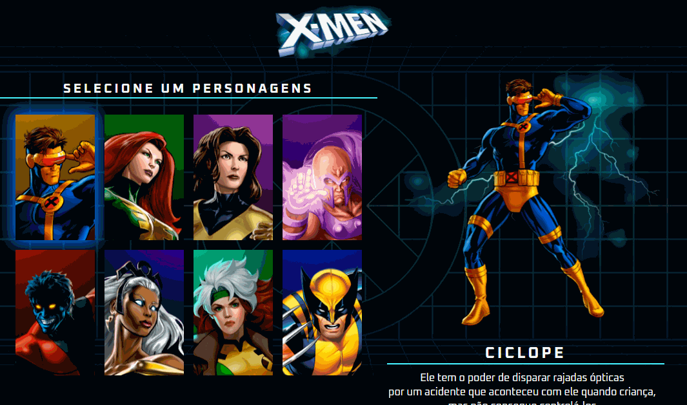

# X-Men



## Propósito

O projeto X-Men foi desenvolvido com o objetivo de oferecer aos fãs da franquia X-Men uma experiência interativa para explorar informações sobre seus personagens favoritos. Ao proporcionar uma interface intuitiva e atraente, o projeto visa demonstrar os conhecimento adquiridos através do curso DevQuest.

## Funcionalidades

1. **Seleção de Personagens:**

   - Os usuários podem explorar uma lista de personagens X-Men disponíveis para seleção.

2. **Visualização de Informações:**

   - Ao selecionar um personagem, a imagem e as informações detalhadas do personagem são exibidas dinamicamente.

3. **Atualização Dinâmica:**

   - As alterações na seleção de personagens resultam em uma atualização automática da imagem e das informações exibidas ao lado da lista.
   
3. **Experiência Responsiva:**

   - O projeto foi desenvolvido com responsividade, proporcionando uma experiência consistente em diferentes dispositivos, desde telas grandes até dispositivos móveis.
    
## Ferramentas utilizadas

1. **HTML:**
   -  Estruturação do conteúdo.

2. **CSS:**
   - Estilização e apresentação visual.

3. **JavaScript:**
   - Lógica de validação e interatividade.

## Decisões de Projeto

1. **Separação de Responsabilidades em Arquivos:**
   - Mantive a separação de arquivos CSS para a melhor organização dos estilos e facilitar o desenvolvimento do projeto. Os arquivos CSS estão estruturados de acordo com a função e escopo, seguindo um padrão de nomenclatura claro.

   - A separação em pastas também foi uma decisão tomada a fim de manter a organização.

## Como utilizar

1. Clone o repositório:

    ```bash
    git clone https://github.com/Paulo-Heber/X-Men.git
    ```

2. Abra a pasta do projeto e dê dois cliques sobre o arquivo index.html.


